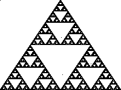

# Sierpinski Triangle Generator in Rust

A simple program that generates a Sierpinski triangle in rust.  The
triangle is generated using the chaos method, storage in an image
buffer, and then written out to a file named "tri.png" in the current
working directory.

